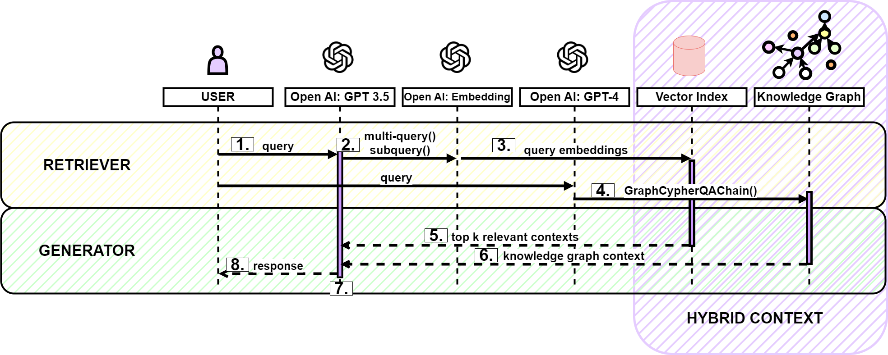

## Hybrid Context Retrieval Augmented Generation Pipeline: LLM-Augmented Knowledge Graphs and Vector Database for Accreditation Reporting Assistance

### Abstract
In higher education, accreditation is a quality assurance process, where an institution demonstrates a commitment to delivering high quality programs and services to their students. For business schools nationally and internationally the Association to Advance Collegiate Schools of Business (AACSB) accreditation is the gold standard. For a business school to receive and subsequently maintain accreditation, the school must undertake a rigorous, time consuming reporting and peer review process, to demonstrate alignment with the AACSB Standards. For this project we create a hybrid context retrieval augmented generation pipeline that can assist in the documentation alignment and reporting process necessary for accreditation. We implement both  a vector database and knowledge graph, as knowledge stores containing both institutional data and AACSB Standard data. The output of the pipeline can be used by institution stakeholders to build their accreditation report, dually grounded by the context from the knowledge stores. To develop our knowledge graphs we utilized both a manual construction process as well as an ‘LLM Augmented Knowledge Graph’ approach. We evaluated the pipeline using the RAGAs framework and observed optimal performance on answer relevancy and answer correctness metrics. 





### System Flow
System Flow Steps:

  1. User Query: User initiates natural language query.

    ```q0: “Which learning objectives did out undergraduate program evaluate”```


  2. Query Optimization: Query is routed and expanded to multiple queries.
```
    q1: “What are the learning objectives that our undergraduate program evaluated?”
    q2: “What were the learning objectives assessed in our undergraduate program?”
    q3: “Which learning objectives were evaluated in our undergraduate program?”
```

  3. Query Embedding: Queries{q1, q2, q3} are passed to the text embedding model.

  4. Query Conversion: Original natural language query (q0) is passed into model, and converted to a Cypher query using LangChain’s GraphCypheryQAChain().

  5. Vector Index Context Retrieval: Vector index returns the top k (k=2), embeddings based on cosine similarly to the query embeddings.

  6. Knowledge Graph Context Retrieval: Knowledge graph query returns information based on the Cypher query. 

  7. Generator: Hybrid context from vector index and knowledge graph are passed in the model along with the original query to generate response to the query.

  8. Response Returned: Generated response is returned to the user.


### Project Overview:

This project implements an advanced retrieval augmented generation architecture, integrating both data stored as vector embeddings and data structured as a knowledge graph. This project implements several query optimization techniques and multi-source retrieval to provide context to ground the generated output response. This project uses Large Language Models for several tasks including knowledge graph construction. 

The project is built using Python and Cypher, with Neo4j as the database management system (DBMS). The project also combines frameworks like LangChain, with custom pipeline development. Along with the RAGAs framework for pipeline evaluation.

GIT: https://github.com/CS-Edwards/advRAG
BRANCH: Accreditation

### Introduction:

Accreditation maintenance for degree granting higher education institutions is a multi-year task involving dozens of internal and external stakeholders. For business schools nationally and internationally the Association to Advance Collegiate Schools of Business (AACSB) accreditation is the gold standard for accreditation. The accreditation signifies a commitment to: engaging curriculum, student success, valuable research contribution, cutting edge facilities and more. Over 900 business schools across the world are AACSB accredited. 

As the current protocol stands, schools are required to submit a ‘Continuous Improvement Report’ and prepare for an AACSB on-site visit every five years. The development of this report and preparation for the peer review visit can take about a year of preparation. The school’s are evaluated based on their alignment with the AACSB Standards. 

The goal of this project is to implement an advanced retrieval augmented generation pipeline, for the purposes of easing the report development process. Utilizing this pipeline, institutions will be able to integrate their own documents into the database which is prepopulated with AACSB Standard data.

Users are able to query their own institutional data and alongside AACSB data, to evaluate how their documents align with the standards. Given that the queries are based on natural language, the application makes institutional accreditation accessible to a wide range of stakeholders including, administrators, faculty, students, and committees.

